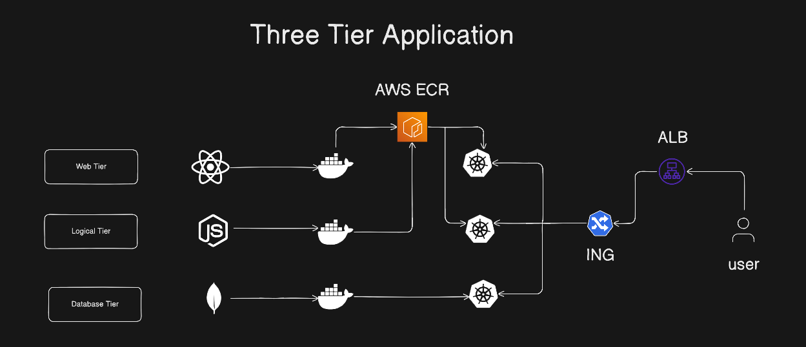
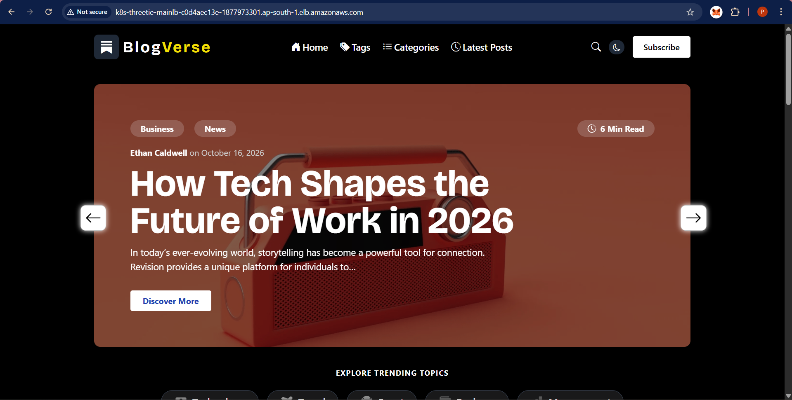

<h1>BlogVerse-Three-tier-deployment</h1>

  

<h1>Getting Started</h1>

To get started with this project, refer to our comprehensive guide that walks you through IAM user setup, infrastructure provisioning, CI/CD pipeline configuration, EKS cluster creation, and more.

<h1>Step 1: IAM Configuration</h1>

    Create a user eks-admin with AdministratorAccess.
    
Generate Security Credentials: Access Key and Secret Access Key.

<h1>Step 2: EC2 Setup</h1>

    ubuntu Instance
    t2.micro
    20GBi
    create access key with .pem
    region ap-south-1

    connect it with ssh client with command line in your system

after login 

    sudo-apt get update
    

SSH into the instance from your local machine.

<h3>Step 3: Install AWS CLI v2</h3>

    curl "https://awscli.amazonaws.com/awscli-exe-linux-x86_64.zip" -o "awscliv2.zip"
    sudo apt install unzip
    unzip awscliv2.zip
    sudo ./aws/install -i /usr/local/aws-cli -b /usr/local/bin --update

    aws configure

<h1>Step 4: Install Docker</h1>

    sudo apt-get update
    sudo apt install docker.io
    docker ps
    sudo chown $USER /var/run/docker.sock

Retrieve an authentication token and authenticate your Docker client to your registry. Use the AWS CLI:

    aws ecr-public get-login-password --region us-east-1 | docker login --username AWS --password-stdin public.ecr.aws/r7m1r0t0
    
Note: If you receive an error using the AWS CLI, make sure that you have the latest version of the AWS CLI and Docker installed. Build your Docker image using the following command. For information on building a Docker file from scratch see the instructions here . You can skip this step if your image is already built:

    docker build -t blogverse-client-app .
    
After the build completes, tag your image so you can push the image to this repository:

    docker tag blogverse-client-app:latest public.ecr.aws/r7m1r0t0/blogverse-client-app:latest
    
Run the following command to push this image to your newly created AWS repository:

    docker push public.ecr.aws/r7m1r0t0/blogverse-client-app:latest

Retrieve an authentication token and authenticate your Docker client to your registry. Use the AWS CLI:

    aws ecr-public get-login-password --region us-east-1 | docker login --username AWS --password-stdin public.ecr.aws/r7m1r0t0
    
Note: If you receive an error using the AWS CLI, make sure that you have the latest version of the AWS CLI and Docker installed.
Build your Docker image using the following command. For information on building a Docker file from scratch see the instructions here . You can skip this step if your image is already built:

    docker build -t blogverse-server-app .
    
After the build completes, tag your image so you can push the image to this repository:

    docker tag blogverse-server-app:latest public.ecr.aws/r7m1r0t0/blogverse-server-app:latest
    
Run the following command to push this image to your newly created AWS repository:

    docker push public.ecr.aws/r7m1r0t0/blogverse-server-app:latest

<h1>Step 5: Install kubectl</h1>

    curl -o kubectl https://amazon-eks.s3.us-west-2.amazonaws.com/1.19.6/2021-01-05/bin/linux/amd64/kubectl
    chmod +x ./kubectl
    sudo mv ./kubectl /usr/local/bin
    kubectl version --short --client

<h1>Step 6: Install eksctl</h1>

    curl --silent --location "https://github.com/weaveworks/eksctl/releases/latest/download/eksctl_$(uname -s)_amd64.tar.gz" | tar xz -C /tmp
    sudo mv /tmp/eksctl /usr/local/bin
    eksctl version

<h1>Step 7: Setup EKS Cluster</h1>

    eksctl create cluster --name three-tier-cluster --region us-west-2 --node-type t2.medium --nodes-min 2 --nodes-max 2
    aws eks update-kubeconfig --region us-west-2 --name three-tier-cluster
    kubectl get nodes
    
<h1>Step 8: Run Manifests</h1>

    kubectl create namespace three-tier
    kubectl apply -f .
    kubectl delete -f .

<h1>Step 9: Install AWS Load Balancer</h1>

    curl -O https://raw.githubusercontent.com/kubernetes-sigs/aws-load-balancer-controller/v2.5.4/docs/install/iam_policy.json
    aws iam create-policy --policy-name AWSLoadBalancerControllerIAMPolicy --policy-document file://iam_policy.json
    eksctl utils associate-iam-oidc-provider --region=ap-south-1 --cluster=three-tier --approve
    eksctl create iamserviceaccount --cluster=three-tier-cluster --namespace=kube-system --name=aws-load-balancer-controller --role-name AmazonEKSLoadBalancerControllerRole --attach-policy-arn=arn:aws:iam::626072240565:policy/AWSLoadBalancerControllerIAMPolicy --approve --region=ap-south-1

<h1>Step 10: Deploy AWS Load Balancer Controller</h1>

    sudo snap install helm --classic
    helm repo add eks https://aws.github.io/eks-charts
    helm repo update eks
    helm install aws-load-balancer-controller eks/aws-load-balancer-controller -n kube-system --set clusterName=my-cluster --set serviceAccount.create=false --set serviceAccount.name=aws-load-balancer-controller
    kubectl get deployment -n kube-system aws-load-balancer-controller
    

<h1>Step 11: Ingress </h1>

    kubectl apply -f full_stack_lb.yaml

Check the deployment through load balancer get the dns

    k8s-threetie-mainlb-c0d4aec13e-1877973301.ap-south-1.elb.amazonaws.com

  

    
  

    
Cleanup

To delete the EKS cluster:

    eksctl delete cluster --name three-tier --region ap-south-1
    
To clean up rest of the stuff and not incure any cost

    Stop or Terminate the EC2 instance created in step 2.
    
    Delete the Load Balancer created in step 9 and 10.

