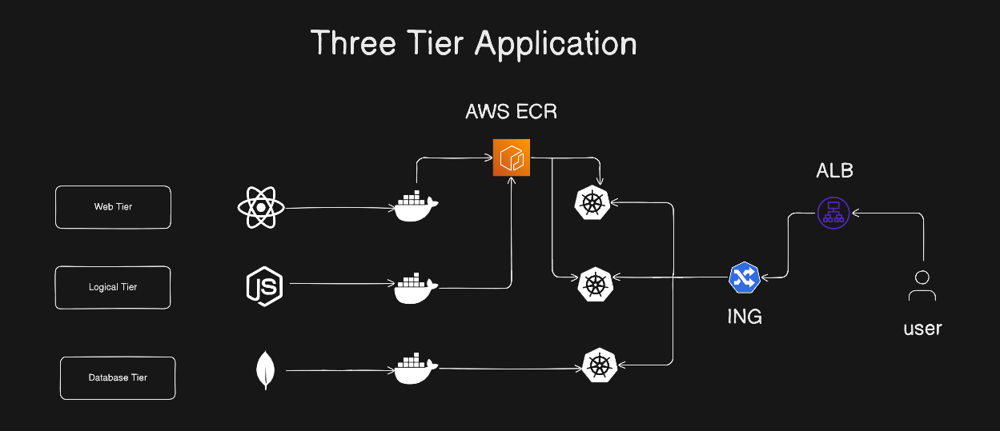
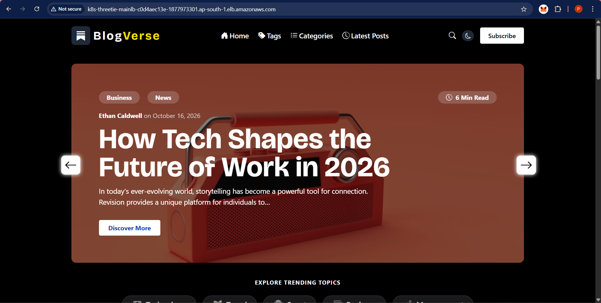

<div align="center">
  <h1>🚀 BlogVerse</h1>
  <p><strong>A Production-Ready, Highly Scalable, Cloud-Native Publishing SaaS Platform</strong></p>

  

  
  
  
  
  
  
  
</div>

---

## 📖 Overview

BlogVerse has been completely modernized into a real-world, highly available three-tier application. Designed for speed, scale, and uncompromising security, BlogVerse leverages modern cloud-native engineering practices, GitOps deployments, and an enterprise-grade observability stack.

### 🌟 Key Features
- **Frontend Architecture:** Feature-Sliced Design with React, Vite, and TailwindCSS (Glassmorphic layouts, true Dark Mode).
- **Backend Architecture:** Domain-Driven Design (DDD) with Controller-Service-Repository separation.
- **Database Engineering:** Advanced MongoDB aggregation pipelines, compound indexing, and soft-delete capabilities.
- **Security Hardening:** Dual-token JWT authentication (Access + HttpOnly Refresh Tokens), rate limiting, Helmet, XSS, and NoSQL injection protection.
- **DevOps & CI/CD:** Fully automated GitHub Actions pipelines, running security scans (Trivy), and deploying multi-stage, non-root Docker containers.
- **Cloud Infrastructure:** Multi-AZ Amazon EKS cluster with dedicated NAT Gateways, ALB Ingress, and AWS WAF.
- **Observability Stack:** Comprehensive monitoring using Prometheus, Grafana, and Loki.

---

## 🏗️ Architecture

BlogVerse uses a scalable **Three-Tier Architecture**:
1. **Client Tier:** A React SPA delivered via optimized NGINX containers, communicating securely via REST APIs.
2. **Application Tier:** Node.js & Express APIs running on an EKS cluster, managed dynamically by the Horizontal Pod Autoscaler.
3. **Data Tier:** Highly indexed MongoDB collections designed to handle complex relationships (Likes, Bookmarks, Comments) without hitting document limits.

<p align="center">
  
</p>

---

## 🛠️ Local Development Setup

To run this application locally, you must have Docker, Node.js v20+, and MongoDB installed.

### 1. Backend (`server/`)
```bash
cd server
npm install
# Ensure you configure your .env file
npm run dev
```

### 2. Frontend (`client/`)
```bash
cd client
npm install
npm run dev
```

---

## ☁️ AWS EKS Production Deployment Guide

This guide covers provisioning your AWS infrastructure from scratch using the CLI.

### Step 1: IAM Configuration
Create an IAM user (`eks-admin`) with `AdministratorAccess` and generate Access Keys.

### Step 2: Bootstrapping EC2 (Jump Host)
1. Launch an `ubuntu` `t2.micro` EC2 instance in your chosen region (e.g., `ap-south-1`).
2. SSH into the instance:
```bash
sudo apt-get update
```

### Step 3: Install AWS CLI v2
```bash
curl "https://awscli.amazonaws.com/awscli-exe-linux-x86_64.zip" -o "awscliv2.zip"
sudo apt install unzip
unzip awscliv2.zip
sudo ./aws/install -i /usr/local/aws-cli -b /usr/local/bin --update
aws configure # Provide the IAM credentials generated in Step 1
```

### Step 4: Install Docker & Push to ECR
```bash
sudo apt install docker.io -y
sudo chown $USER /var/run/docker.sock

# Login to AWS ECR Public (Replace registry URL with your own)
aws ecr-public get-login-password --region us-east-1 | docker login --username AWS --password-stdin public.ecr.aws/r7m1r0t0

# Build and Push Client
docker build -t blogverse-client-app ./client
docker tag blogverse-client-app:latest public.ecr.aws/r7m1r0t0/blogverse-client-app:latest
docker push public.ecr.aws/r7m1r0t0/blogverse-client-app:latest

# Build and Push Server
docker build -t blogverse-server-app ./server
docker tag blogverse-server-app:latest public.ecr.aws/r7m1r0t0/blogverse-server-app:latest
docker push public.ecr.aws/r7m1r0t0/blogverse-server-app:latest
```

### Step 5: Install Kubernetes CLI (`kubectl`)
```bash
curl -LO "https://dl.k8s.io/release/$(curl -L -s https://dl.k8s.io/release/stable.txt)/bin/linux/amd64/kubectl"
chmod +x ./kubectl
sudo mv ./kubectl /usr/local/bin
```

### Step 6: Install `eksctl`
```bash
curl --silent --location "https://github.com/weaveworks/eksctl/releases/latest/download/eksctl_$(uname -s)_amd64.tar.gz" | tar xz -C /tmp
sudo mv /tmp/eksctl /usr/local/bin
```

### Step 7: Provision the EKS Cluster
Deploy the Highly Available architecture specified in our manifest:
```bash
eksctl create cluster -f k8s-manifestfile/eks-cluster-config.yaml
aws eks update-kubeconfig --region ap-south-1 --name blogverse-prod-cluster
```

### Step 8: Deploy the Application
```bash
kubectl create namespace three-tier
kubectl apply -f k8s-manifestfile/
```

### Step 9: Install AWS Load Balancer Controller
This allows Kubernetes Ingress resources to provision native AWS Application Load Balancers.
```bash
curl -O https://raw.githubusercontent.com/kubernetes-sigs/aws-load-balancer-controller/v2.5.4/docs/install/iam_policy.json
aws iam create-policy --policy-name AWSLoadBalancerControllerIAMPolicy --policy-document file://iam_policy.json
eksctl utils associate-iam-oidc-provider --region=ap-south-1 --cluster=blogverse-prod-cluster --approve
eksctl create iamserviceaccount --cluster=blogverse-prod-cluster --namespace=kube-system --name=aws-load-balancer-controller --role-name AmazonEKSLoadBalancerControllerRole --attach-policy-arn=arn:aws:iam::[ACCOUNT_ID]:policy/AWSLoadBalancerControllerIAMPolicy --approve --region=ap-south-1
```

### Step 10: Deploy the Load Balancer Controller via Helm
```bash
sudo snap install helm --classic
helm repo add eks https://aws.github.io/eks-charts
helm repo update eks
helm install aws-load-balancer-controller eks/aws-load-balancer-controller -n kube-system --set clusterName=blogverse-prod-cluster --set serviceAccount.create=false --set serviceAccount.name=aws-load-balancer-controller
```

### Step 11: Deploy Observability Stack (Optional but Recommended)
Monitor your EKS cluster with Prometheus, Grafana, and Loki.
```bash
kubectl create namespace observability
helm repo add prometheus-community https://prometheus-community.github.io/helm-charts
helm repo add grafana https://grafana.github.io/helm-charts
helm repo update

helm install prometheus prometheus-community/kube-prometheus-stack -n observability
helm install loki grafana/loki-stack -n observability

# Apply custom service monitors
kubectl apply -f k8s-manifestfile/observability.yaml
```

---

## 🧹 Cleanup
To avoid incurring unnecessary AWS costs, tear down your cluster when finished:
```bash
eksctl delete cluster -f k8s-manifestfile/eks-cluster-config.yaml
```
*Note: Also terminate your EC2 Jump Host and manually delete any remaining ELBs in the AWS Console.*

---

## 🛡️ Security Posture
- **CI/CD**: GitHub actions enforcing linting (`husky` pre-commits) and preventing merged code breaks.
- **Docker**: Rootless execution (`USER node`, `USER nginxuser`) minimizing blast radius in case of container escapes.
- **Traffic**: Validated using `zod`, protected against DDoSing with `express-rate-limit`, sanitized headers with `helmet`.

<p align="center"><i>Engineered with modern practices by the BlogVerse Team</i></p>
